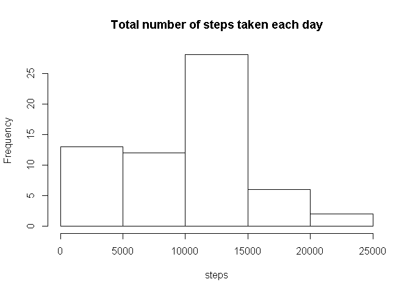
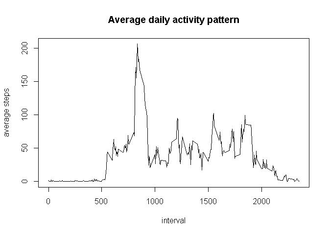
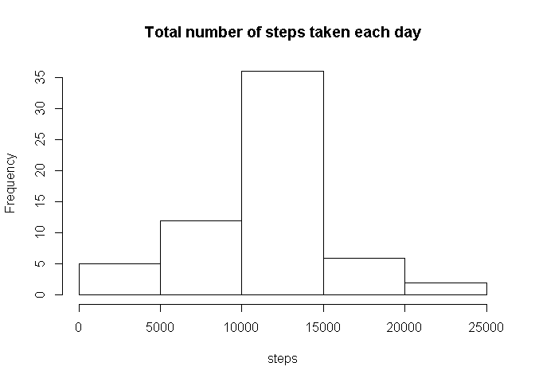
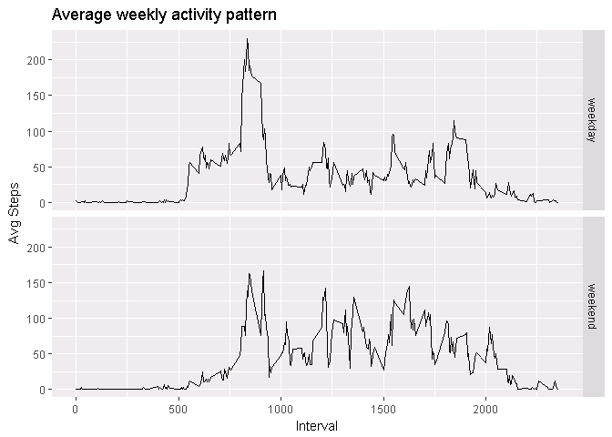

Loading and preprocessing the data
----------------------------------

    data <- read.csv("activity.csv")
    str(data)

    ## 'data.frame':    17568 obs. of  3 variables:
    ##  $ steps   : int  NA NA NA NA NA NA NA NA NA NA ...
    ##  $ date    : Factor w/ 61 levels "2012-10-01","2012-10-02",..: 1 1 1 1 1 1 1 1 1 1 ...
    ##  $ interval: int  0 5 10 15 20 25 30 35 40 45 ...

    agg <- aggregate(data$steps, by=list(data$date), FUN=sum, na.rm=TRUE)
    hist(agg$x, main="Total number of steps taken each day", xlab="steps")

What is mean total number of steps taken per day?
-------------------------------------------------

    mean(agg$x)

    ## [1] 9354.23

    median(agg$x)

    ## [1] 10395

What is the average daily activity pattern?
-------------------------------------------

    avg <- aggregate(data$steps, by=list(data$interval), FUN=mean, na.rm=TRUE)
    plot(avg, type="l", main ="Average daily activity pattern", xlab = "interval", ylab = "average steps")

    avg[which.max(avg$x),1]

    ## [1] 835

Imputing missing values
-----------------------

-   show a summary of the data table (with counting NAs)
-   Input the average by interval in case of missing values in the
    column "steps"
-   Split the data set in one having only NA and one without NA
-   for the dataset with NA, assign the same factors as in the column
    "interval"
-   Input the average value of steps by interval and convert to number
-   Merge back the 2 datasets

<!-- -->

    summary(data)

    ##      steps                date          interval     
    ##  Min.   :  0.00   2012-10-01:  288   Min.   :   0.0  
    ##  1st Qu.:  0.00   2012-10-02:  288   1st Qu.: 588.8  
    ##  Median :  0.00   2012-10-03:  288   Median :1177.5  
    ##  Mean   : 37.38   2012-10-04:  288   Mean   :1177.5  
    ##  3rd Qu.: 12.00   2012-10-05:  288   3rd Qu.:1766.2  
    ##  Max.   :806.00   2012-10-06:  288   Max.   :2355.0  
    ##  NA's   :2304     (Other)   :15840

    dataNNA <- data[!is.na(data$steps),]
    dataNA <- data[is.na(data$steps),]
    dataNA$steps <- as.factor(dataNA$interval)
    levels(dataNA$steps) <- as.numeric(avg$x)
    dataNA$steps <- as.integer(as.vector(dataNA$steps))
    data2 <- rbind(dataNNA, dataNA)

    agg2 <- aggregate(data2$steps, by=list(data2$date), FUN=sum, na.rm=TRUE)

    hist(agg2$x, main="Total number of steps taken each day", xlab="steps")

    mean(agg2$x)

    ## [1] 10749.77

    median(agg2$x)

    ## [1] 10641

Are there differences in activity patterns between weekdays and weekends?
-------------------------------------------------------------------------

-   get the day of the week with weekdays()
-   classify into weekday or weekend
-   compute average steps by day class and interval

<!-- -->

    library(ggplot2)
    data2$wday <- factor(weekdays(as.Date(data2$date)))
    data2$dayclass <- factor(ifelse(data2$wday == 'Sunday' | data2$wday == 'Saturday', 'weekend', 'weekday'))

    avg2 <- aggregate(data2$steps, by=list(data2$interval, data2$dayclass), FUN=mean, na.rm=TRUE)

    names(avg2) = c('interval','dayType','steps')
    ggplot(avg2, aes(x = avg2$interval, y = avg2$steps, group = avg2$dayType)) + geom_line() + facet_grid(avg2$dayType ~.) + labs(x = "Interval", y = "Avg Steps", title = "Average weekly activity pattern")

